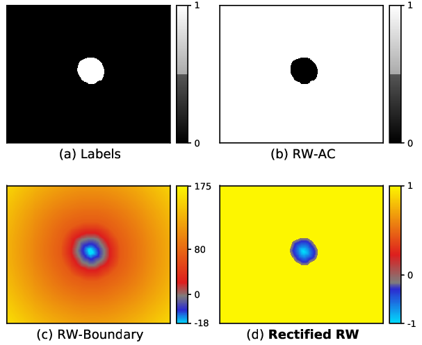

Region-wise loss
======================

[](https://www.google.com)
[](https://github.com/jmlipman/RegionWiseLoss/blob/main/LICENSE)

Repository of the paper [Region-wise Loss for Biomedical Image Segmentation](https://www.google.com).



### Table of Contents
* [1. Region-wise loss](#1-region-wise-loss)
* [2. Reproducibility](#2-reproducibility)
* [3. Citation](#3-citation)
* [4. Contact](#4-contact)

### 1. Region-wise loss
Region-wise loss can be easily implemented as the pixel-wise multiplication between the softmax probabilities and a region-wise map.

```
# See: training/loss_functions/rwexp_loss.py
loss = torch.mean(softmax_prob * rrwmap)
```

The proposed rectified region-wise map (Figure above, (d)) can be computed as:

```
# See: training/loss_functions/rwexp_loss.py
from scipy.ndimage import distance_transform_edt as dist

rrwmap = np.zeros_like(Y) # Y: one-hot encoded ground truth
for b in range(rrwmap.shape[0]): # Batch dim
    for c in range(rrwmap.shape[1]): # Channel dim
        rrwmap[b, c] = dist(Y[b, c]) 
        rrwmap[b, c] = -1 * (rrwmap[b, c] / (np.max(rrwmap[b, c] + 1e-15)))
rrwmap[rrwmap==0] = 1 
```

Computing these region-wise maps on the fly (i.e., during the optimization) can be useful in certain scenarios, such as for applying transfer learning or, in general, to penalize/highlight certain areas or classes based on the performance of previous iterations. Their computation is fast, especially when setting  Pytorch's Dataloader num_works=6 or more. However, to save computations, one can also generate these region-wise maps before the optimization and load them as if they were the images or ground truth.

### 2. Reproducibility
For the sake of transparency and reproducibility, this repository includes:
* The code of the exact version of nnUNet utilized in our experiments ([here](https://github.com/jmlipman/RegionWiseLoss/tree/main/nnUNet)).
* The modified nnUNet files to reproduce our experiments (details below).
* The scripts to derive the exact train-test split of the three datasets that we utilized for training and evaluating nnUNet ([here](https://github.com/jmlipman/RegionWiseLoss/tree/main/datasplits)).

The easiest way to reproduce our experiments is by installing nnUNet following its official [documentation](https://github.com/MIC-DKFZ/nnUNet/) and including the lines of code that we added. We only modified three files of nnUNet and added another file:
* training/network_training/network_trainer.py: after each epoch, we generated and evaluated the predictions (i.e., validation).
* training/network_training/nnUNetTrainerV2.py: we changed the optimizer to Adam and selected which loss function to optimize.
* training/loss_functions/deep_supervision.py: we passed the current epoch to the loss function in case it was needed, as in BoundaryLoss to decrease alpha.
* (new file) training/loss_functions/rwexp_loss.py: all studied loss functions can be found here.

How to use nnUNet to run our experiments (very short summary):
1. (Recommneded) Create a virtual environment and install all the [required libraries](https://github.com/jmlipman/RegionWiseLoss/blob/main/nnUNet/requirements.txt)
2. Download the data and execute the [corresponding scripts](https://github.com/jmlipman/RegionWiseLoss/tree/main/datasplits) to prepare the data for nnUNet.
3. Define the environment variables required by nnUNet: nnUNet_raw_data_base, nnUNet_preprocessed, RESULTS_FOLDER.
4. Preprocess the data: nnUNet_plan_and_preprocess -t XXX --verify_dataset_integrity
5. Run the experiment: nnUNet_train 2d nnUNetTrainerV2 TaskXXX_NAME all 


### 3. Citation
```
@article{valverde2021regionwiseloss,
  title={Region-wise Loss for Biomedical Image Segmentation},
  author={Valverde, Juan Miguel and Tohka, Jussi},
  journal={arXiv preprint arXiv:xxxx.xxxxx},
  year={2021}
}
```

### 4. Contact
Feel free to write me an email with questions or feedback at **juanmiguel.valverde@uef.fi**
